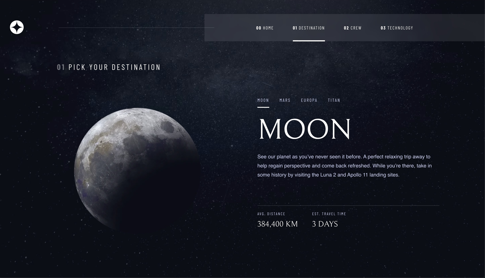
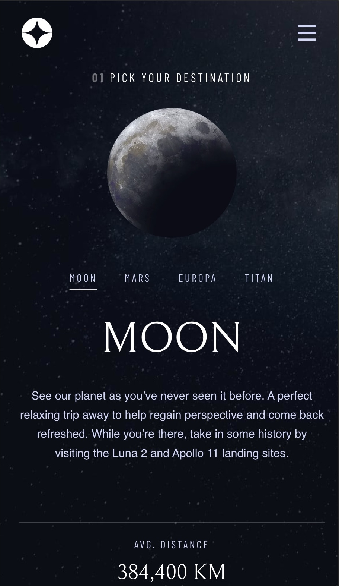

---
# Space Tourism Website

This project is a responsive website for Space Travel. It uses a tab-based navigation system to switch between different sections like **Planets**, **Crew**, and more. The project follows a pre-designed template and ensures mobile and desktop compatibility.
This project showcases my css skills and the ability to build from any provided template.
---

## 📖 Features

- **Tab Navigation**: Switch between sections like planets and crew seamlessly.
- **Responsive Design**: Fully responsive and optimized for different screen sizes.
- **Template-Based Design**: Built exactly as instructed from a provided template.
- **Fast Performance**: Uses Vite for optimized development and build processes.

---

## 🚀 Tech Stack

- **Vite**: Lightning-fast development environment.
- **React**: Component-based UI framework.
- **CSS**: Plain CSS for styling without additional libraries.

---

## 🔧 Installation and Setup

1. **Clone the repository**:

   ```bash
   git clone https://github.com/shay122990/space-tourism-website
   cd space-tourism-website
   ```

2. **Install dependencies**:

   ```bash
   npm install
   ```

3. **Start the development server**:

   ```bash
   npm run dev
   ```

4. **Build for production**:
   ```bash
   npm run build
   ```

---

## 🌐 Live Demo

You can check out the live version of the site here: [Live Demo](https://space-tourism-shay90.netlify.app/)

---

## 📱 Screenshots

### Desktop View:



### Mobile View:



---

## 🛠️ Future Improvements

- Add animations to tab transitions.
- Integrate APIs to fetch real data for planets and crew.
- Enhance accessibility features.

---

## 🤝 Contribution

Contributions are welcome! Feel free to open issues or submit pull requests.

---

## 📄 License

This project is licensed under the MIT License.

---

## 💬 Acknowledgments

- Template provided by: [Frontend Mentor](https://www.frontendmentor.io/)

---
